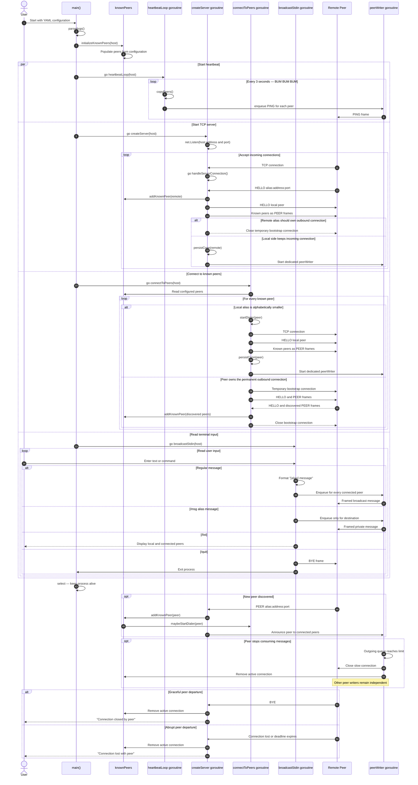
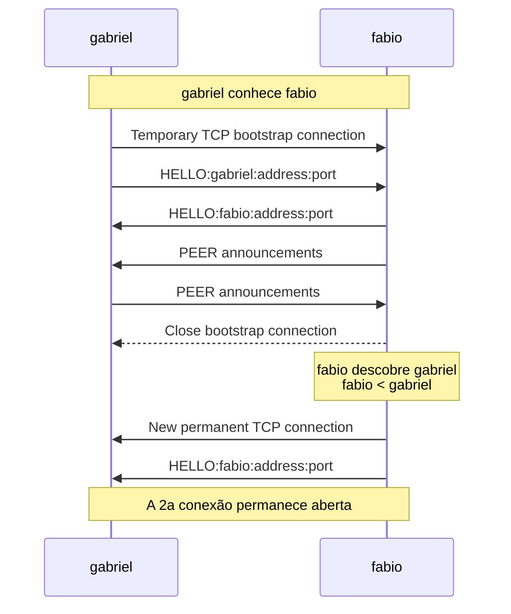

# Chat lifecycle sequence

The `par` block represents the four long-running goroutines started after the
initial known-peer list is populated: heartbeat, TCP listener, outbound
connection management, and terminal input.

